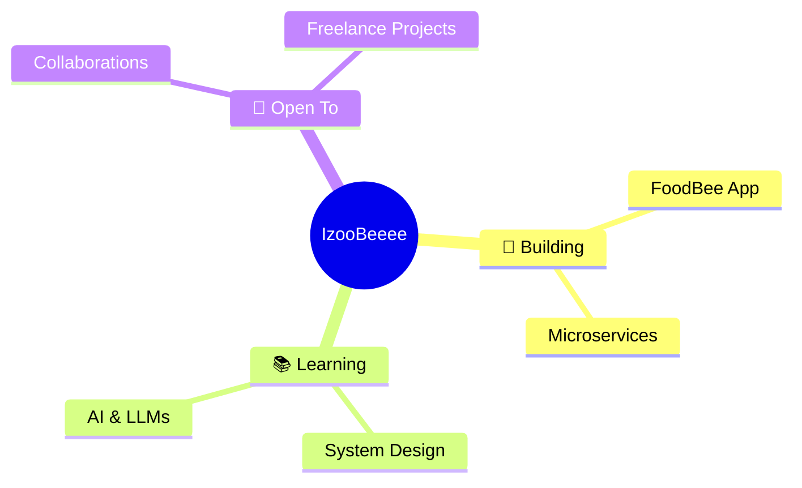

<div align="center">

<!-- Animated banner -->


<!-- Typing SVG -->
<a href="https://git.io/typing-svg">
  
</a>

<br/>

<!-- Social badges -->
[](https://github.com/IzooBeeee)
[](https://github.com/IzooBeeee)

</div>

---

<!-- About Me -->


## 🧑‍💻 About Me

```yaml
name:       IzooBeeee
location:   Vietnam 🇻🇳
role:       Full-Stack Developer
focus:      Web & Mobile Applications
mindset:    Ship fast. Learn faster. Break nothing.
currently:  Building cool stuff 🚀
```

- 🔭 &nbsp;Đang xây dựng những thứ **thú vị và có ích**
- 🌱 &nbsp;Luôn học hỏi những **công nghệ mới nhất**
- ⚡ &nbsp;Fun fact: Tôi debug bằng **niềm tin và cà phê**
- 💬 &nbsp;Cứ tự nhiên hỏi tôi về **Web Dev, System Design**
- 📫 &nbsp;Liên hệ: **[izoo.beee@gmail.com](mailto:izoo.beee@gmail.com)**

---

## 🛠️ Tech Stack

<div align="center">

### 💻 Languages


### 🌐 Frontend


### ⚙️ Backend


### 🗄️ Databases & Cloud


### 🔧 Tools & Others


</div>

---

## 📊 GitHub Stats

<div align="center">


</div>

<div align="center">

[](https://git.io/streak-stats)

</div>

<div align="center">

[](https://github.com/ashutosh00710/github-readme-activity-graph)

</div>

---

## 🏆 GitHub Trophies

<div align="center">

[](https://github.com/ryo-ma/github-profile-trophy)

</div>

---

## 🎯 Current Focus



---

## 💡 A Random Dev Quote

<div align="center">

[](https://github.com/piyushsuthar/github-readme-quotes)

</div>

---

## 🤝 Connect With Me

<div align="center">

[](https://facebook.com/IzooBeeee)
[](https://linkedin.com/in/IzooBeeee)
[](mailto:izoo.beee@gmail.com)
[](https://IzooBeeee.dev)

</div>

---

<div align="center">

<!-- Snake animation -->
<picture>
  <source media="(prefers-color-scheme: dark)" srcset="https://raw.githubusercontent.com/IzooBeeee/IzooBeeee/output/github-contribution-grid-snake-dark.svg">
  <source media="(prefers-color-scheme: light)" srcset="https://raw.githubusercontent.com/IzooBeeee/IzooBeeee/output/github-contribution-grid-snake.svg">
  
</picture>

<br/>

<!-- Footer wave -->


<sub>⭐ From <a href="https://github.com/IzooBeeee">IzooBeeee</a> — crafted with ❤️ & ☕</sub>

</div>
